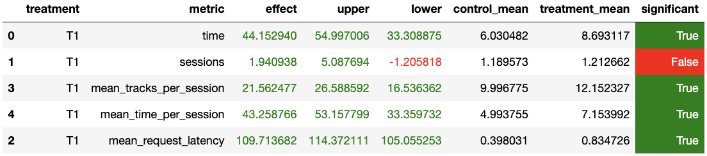

# Домашнее задание

## Abstract
Основная идея нового рекоммендера была в объединении и взвешивании предсказаний 
лучших recommender'ов (`NN`, `Indexed` и `TopPop`), разработанных на занятиях.
Очевидно, что простого подсчета популярности треков, среди рекоммендеров недостаточно,
поэтому для улучшения результатов в модель были введены сущности `like` и `dislike`.

## Детали
Для каждого пользователя будем хранить его лайки и дизлайки в двух различных словарях
по ключу пользователя:
`users_likes: Dict[int, List[int]]` и `users_dislikes: Dict[int, List[int]]`.
Определять понравился трек пользователю или нет будем определять по пороговому значению
для времени прослушивания трека, который задается как аттрибут класса `Weighted`.

Также будем хранить текущую рекомендацию нашей модели (`users_current_recs: Dict[int, Iterator[int]]`)
для каждого пользователя до тех пор, пока пользователь не поставит первый дизлайк
на трек из рекомендованного списка.

**Важное правило**: не рекомендовать треки, которым пользователь _поставил_ дизлайк!

_Комментарий_: понравившиеся треки можно рекомендовать повторно, но они со временем могут быть
перенесены в список _плохих_.

### Примерная блок-схема работы рекомендаций 
                                                                                     ┌───────────────────────────────────┐
                                                                                 ┌──>│даем следующий трек из рекомендаций│<──┐
                                                                                 да  └───────────────────────────────────┘   │
                                             ┌──> [остались еще рекомендации?] ──┤                                           │
                                             │                                   нет                                         │
    ┌──────────────────┐                     да                                  │   ┌───────────────────────────────────┐   │
    │пользователь, трек│ ─── [понравился?] ──┤                                   └──>│   генерируем новые рекомендации   │ ──┘
    └──────────────────┘                     нет                                 ┌──>│на основе последнего понравившегося│
                                             │                                   да  └───────────────────────────────────┘
                                             └──> [есть понравившиеся треки?]  ──┤   
                                                                                 нет ┌──────────────────────────┐
                                                                                 └──>│даем что-то из популярного│
                                                                                     └──────────────────────────┘
### Генерация новых рекомендаций для пользователя
Рекомендации генерируются для пользователя по резултатам работы трех моделей
`NN`, `Indexed (LightFM)` и `TopPop`.

1. Из каждой модели забираем список рекомендаций,
объединяем их в один, удаляем повторения и треки, которые пользователь уже дизлайкал.
2. После чего для каждого уникального трека подсчитываем _вес_ с учетом весов моделей,
определенных в аттрибутах класса `Weighted` (если трек попал в список рекомендаций
модели – прибавляем к весу трека вес модели).
3. Далее сортируем треки по весу, берем первые несколько штук (кол-во также определяется
в аттрибутах класса) и отдаем в рекомендации для пользователя (складываем в словарь текущих рекомендаций).

_Комментарий_: Если так оказалось, что после генерации новой подборки мы получили пустой список –
генерируем список нужного размера из случайных треков, которые пользователь ранее не дизлайкал!

## Результат A/B эксперимента
Условия эксперимента:
`botify/experiments.py`
```python
# new experiment
HW = Experiment("HW", Split.HALF_HALF)
```
`botify/server.py`
```python
# recommenders for Control and Treatment
treatment = Experiments.HW.assign(user)
if treatment == Treatment.T1:
    # recommender = StickyPop(tracks_redis.connection, artists_redis.connection,
    #                         catalog, users_likes, users_dislikes)
    recommender = Weighted(tracks_redis.connection,
                           recommendations_redis.connection,
                           catalog,
                           users_likes, users_dislikes,
                           users_current_recs)
else:
    recommender = Contextual(tracks_redis.connection, catalog)
```
Запуск симуляции:
```bash
python sim/run.py --episodes 2000 --config config/env.yml single --recommender remote --seed 31337 
```

Результат анализа в [блокноте](jupyter/Week1Seminar.ipynb):


## Итог
По результатам эксперимента был олучен прирост целевой метрики `mean_time_per_session` на `53%`.
